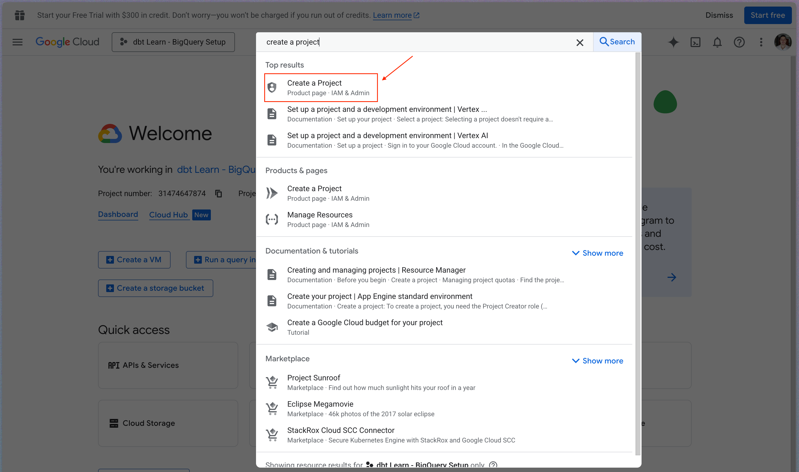
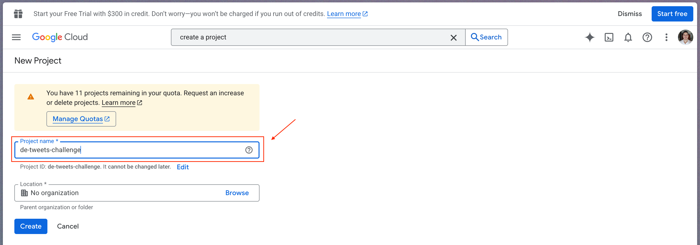
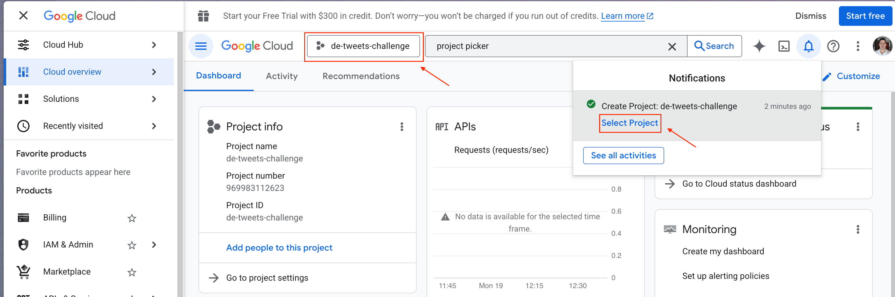
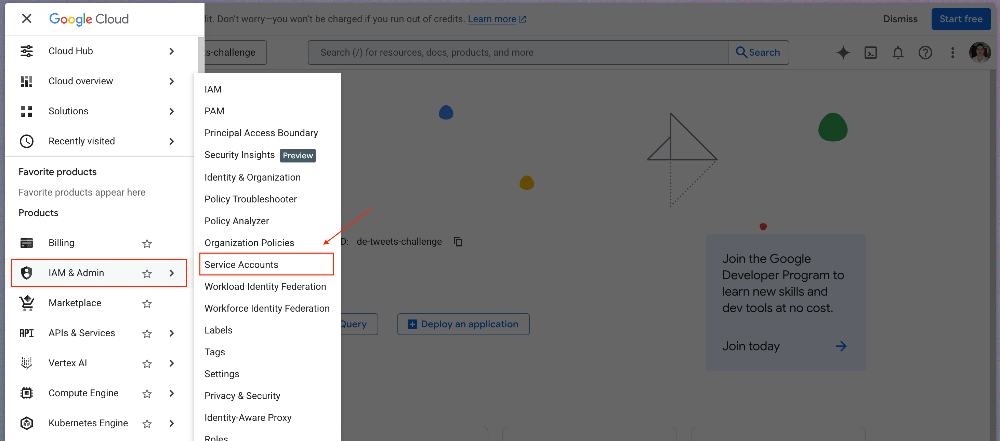
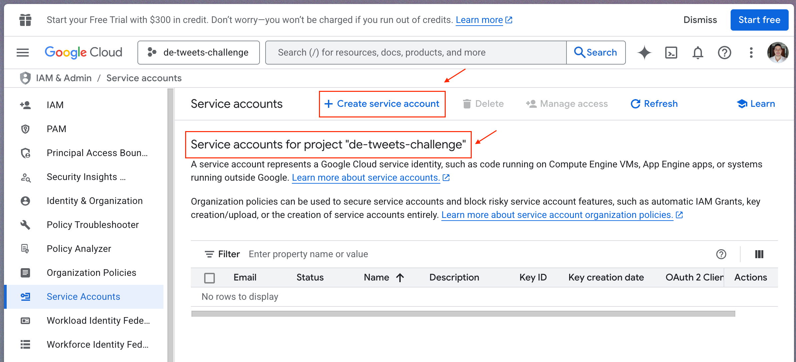

# Instrucciones para desarrollar el reto en Google Cloud Platform (GCP)

1. Loguearse con una cuenta de correo de gmail e [ir a la consola de GCP](https://console.cloud.google.com/).

2. Crear un proyecto. En el buscador, escribir ```create a project``` y elegir la opción ```Create a Project```. También se puede usar el siguiente enlace para [crear un proyecto](https://console.cloud.google.com/projectcreate).



3. Definir el nombre del proyecto como ```de-tweets-challenge``` y dejar lo demás como está predeterminado. Si estás utilizando un computador corporativo, necesitarás seleccionar una organización y tener los permisos para crear un proyecto. Se recomienda utilizar un computador personal o tener los permisos necesarios.



4. Lo anterior te llevará a la consola, y después de unos segundos, tu proyecto estará creado. Al lado del logo de "Google Cloud" está el seleccionador de proyectos. Da clic ahí y selecciona el proyecto ```de-tweets-challenge```que acabamos de crear o revisa tus notificaciones y selecciona el proyecto desde ahí.



5. En el menú de navegación (el panel a la izquierda con los servicios de GCP), selecciona ```IAM & Admin``` y luego ```Service Accounts```.

.

6. Asegurate de que diga ```Service accounts for project "de-tweets-challenge"``` y da clic en ```+ Create a service account```.



7. Dar permisos de ```Storage Admin``` y ```Service Usage Admin``` a la cuenta de servicio creada.


8. En la opción de "Keys" (Llaves), crear la llave privada tipo JSON, y el archivo que se descarga ponerlo en el directorio ```credentials/```. Este directorio debe tener exactamente UN solo archivo JSON con las credenciales de la cuenta de servicio.


9. Ir al notebook ```gcp-cloud-challenge.ipynb``` y ejecutar las celdas.